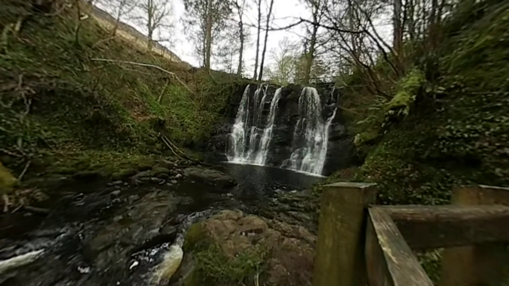
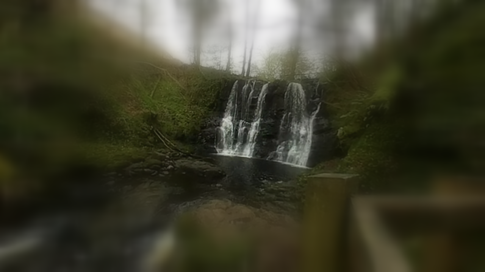
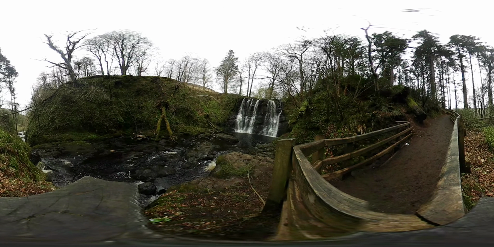

# Bandwidth-Efficient VR Video Streaming

A from-scratch implementation of **tile-based, viewport-adaptive 360° video streaming** for the Meta Quest, with a **foveated blur** fallback so the edges of vision degrade gracefully instead of cutting to black.

360° VR video is expensive to stream — you normally have to send the entire sphere at high quality even though the viewer only ever looks at a small part of it. This project splits each frame into a grid of independent tiles and sends full-quality tiles **only where the user is looking**. Everything else is covered by a tiny low-resolution base layer that the shader blurs more the further it sits from the gaze. The result is the same perceived quality where it matters, for a fraction of the data.

## Demo

| Looking straight ahead (sharp where you look) | High blur coverage (periphery falls off) |
| :---: | :---: |
|  |  |

The sharp window follows the headset's gaze in real time. A single **Blur Coverage** control grows the soft region inward from the edges — and as it grows, the client fetches fewer high-quality tiles, so more blur literally means less bandwidth and fewer video decoders in use.

Source 360° frame the demo streams (equirectangular):



## How it works

**Server (Python / Flask + ffmpeg)**
- `tile_video.py` cuts an equirectangular video into an 8×4 grid of tiles, encodes each at two quality levels, and segments them into short chunks. It also renders one low-resolution copy of the whole panorama as a base layer.
- `app.py` serves the tiles, a manifest describing the grid, and collects client-side metrics (per-frame tile count, throughput, rebuffers).

**Client (Unity / C# on Quest)**
- `ViewportPredictor` reads the headset's forward direction (with a little motion extrapolation) and works out which tiles fall inside the field of view.
- `TileStreamManager` downloads only those tiles, composites them into one equirectangular render texture, and keeps the base layer underneath everything.
- `BandwidthMonitor` watches throughput and drops tiles to the lower quality level when the network can't keep up.
- `FoveatedPanoramic.shader` unwraps the equirectangular texture onto the skybox and blurs the base layer based on the angle from the gaze direction — sharp at the centre, progressively softer toward the edges.

Only about **6 of the 32 tiles** are fetched at full quality on any given frame, which is where the bandwidth saving comes from.

## Results

Measured on the sample waterfall clip (4096×2048, 8×4 grid). "Full sphere" sends all 32 tiles at full quality; "tile-based" sends the handful inside the viewport plus the low-res base layer.

| Approach | Data per clip | vs. full sphere |
| --- | --- | --- |
| Full sphere (32 tiles, high quality) | 23.0 MB | baseline |
| Tile-based (~6 viewport tiles + base) | 5.0 MB | **78% less** |
| Tile-based (~8 viewport tiles + base) | 6.4 MB | **72% less** |
| Tile-based (~12 viewport tiles + base) | 9.3 MB | **60% less** |

At the default viewport size this cuts bandwidth by roughly **72–78%**, in line with published results for tile-based 360 streaming. The base layer that fills the periphery costs only ~0.68 MB — about 3% of the full-sphere total.

There's also a hardware angle: decoding all 32 streams at once is beyond what a Quest can do, while the tile approach decodes only ~7–9 streams. So tiling isn't just bandwidth — it's what makes high-resolution 360 playback feasible on the device at all.

*Prototype measurement on a single clip with CRF-based encoding, not a formal benchmark.*

## Tech stack

- **Python 3**, **Flask**, **ffmpeg** — tiling, encoding, and the streaming server
- **Unity 6 (URP)**, **C#**, **HLSL** — the VR client, compositing, and the foveated skybox shader
- **Meta XR SDK / OpenXR** — Quest head tracking and rendering

## Repository layout

```
server/
  tile_video.py        offline: tile + encode + base layer
  app.py               Flask server (manifest, tiles, metrics)
  requirements.txt
  start_server.bat     one-click launcher (Windows)
unity/
  Scripts/
    TileStreamManager.cs    fetch, composite, drive the shader
    ViewportPredictor.cs    gaze -> visible tiles
    BandwidthMonitor.cs     adaptive quality
    TileManifest.cs         manifest model
  FoveatedPanoramic.shader  equirectangular skybox + foveated blur
  README_UNITY.md           Unity + Quest setup guide
docs/                  diagrams and screenshots
```

## Running it

**Server**
```bash
cd server
python -m venv .venv && .venv/Scripts/activate     # Windows: .venv\Scripts\activate
pip install -r requirements.txt
python tile_video.py input_360.mp4 --cols 8 --rows 4 --seg 2
python app.py --tiles tiles_out --host 0.0.0.0 --port 8080
```
Any equirectangular (2:1) `.mp4` works as the source. Check `http://<your-LAN-ip>:8080/manifest` from a browser to confirm it's serving.

**Client**

See [`unity/README_UNITY.md`](unity/README_UNITY.md) for the full Unity 6 + Quest setup. In short: create a URP project, add the Meta XR camera rig, drop in the scripts, point the `Server Url` at your machine, and assign the `FoveatedPanoramic` shader to the skybox material.

## License

MIT — see [LICENSE](LICENSE).
